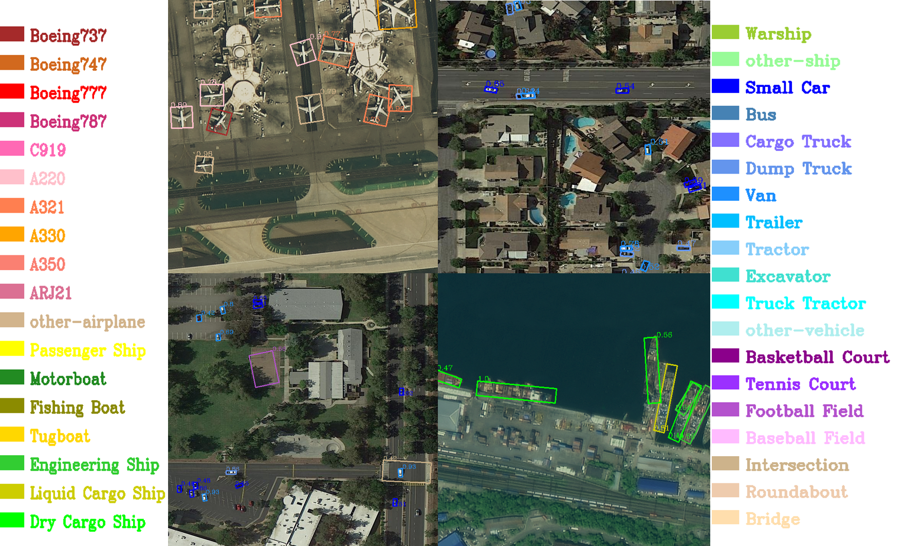

# Fine-grained-OBB-Detection
The third place winning solution (3/220) in the track of Fine-grained Object Recognition in High-Resolution Optical Images, 2021 Gaofen Challenge on Automated High-Resolution Earth Observation Image Interpretation. 
## Solution
### section with new code
* **models**    
 config location:Under folder config/fair1m   
 Strong backbone: add swin transformer  as backbone   
 storng head:     adapt double head to ROI transformer and ReDet
* **Training trick**    
 config location:Under folder：config/fair1m   
 trick：Fine-tuning with SWA and cosine learning rate
* **Trick**    
 file location： competition_trick   
 model emsemble:  WBF（make WBF support oriented bounding box）   
 version tool：   Visualize objects for analysis
### section without new code 
* **models**      
 ReDet, Oriented RCNN, ROITranformer   
* **Tricks**       
 Multi-scale training and testing: Limited by the computing power using two scales of 1.0 and 1.5, and crop images into 1024*1024 with stride 800   
 Lower confidence: Set the output threshold into 0.005.   
 Off-line date augmentation： Random combination of affine transformation, flip, scaling, optical distortion for data augmentation.
 ## Code usage tips   
 install: readme_install.md   
 Dataset format：only support DOTA (Changed the label format of the FAIR1M dataset to DOTA format during the competition)
 ## Detections   

